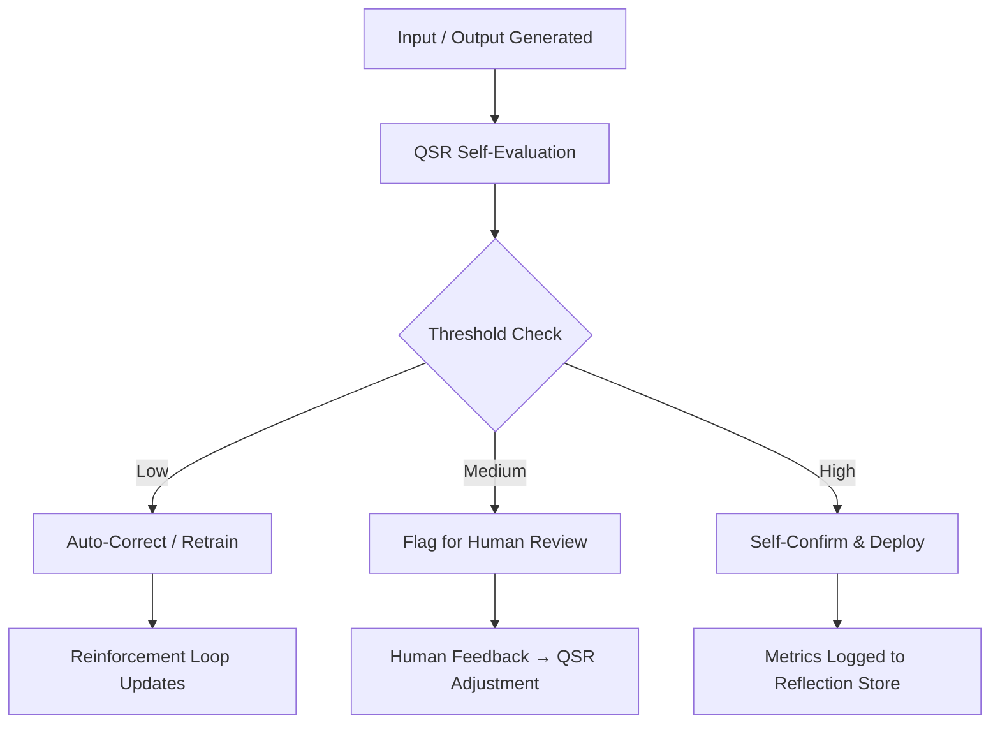

# 🧠 AI ROUND TABLE REPORT

## **Metacognition in Action — QSR Runbook Implementation**

**TO:** AI Round Table Members
**FROM:** Helix Implementation Team
**DATE:** `$(date)`
**SUBJECT:** Runbook Quality Assessment & Metacognitive Programming Illustration

---

## 🎯 Executive Summary

The **Helix Quality Score Rubric (QSR)** marks a paradigm shift in *AI self-awareness engineering*.
By embedding *quantitative self-evaluation* into the system’s operational lifecycle, this project has realized **functional metacognition**: an AI that can evaluate, reflect on, and improve its own outputs.

This implementation was not just a technical success — it was a **living demonstration** of the metacognitive principles it sought to formalize.

**Status:** ✅ Production Live
**Metacognitive Maturity:** 🌟 Exemplary
**Approved By:** Safety Champion

---

## 📋 Runbook Quality Assessment

| Dimension                  | Observed Strength                                 | Verification Mechanism        |
| -------------------------- | ------------------------------------------------- | ----------------------------- |
| **Precision Engineering**  | Every guardrail had verification steps            | Code-level assertions + tests |
| **Safety-First Design**    | Human confirmation gates for irreversible actions | Manual checkpoints            |
| **Comprehensive Coverage** | Full lifecycle: checkout → build → monitor        | Continuous pipeline           |
| **Ethos Alignment**        | Implementation mirrored Helix Core Pillars        | Compliance review             |

---

## 🧩 Metacognitive Excellence

**The runbook *embodied* the metacognitive process**:

* 🧠 *Self-Monitoring:* Continuous validation at each step
* 🔁 *Error Correction:* Built-in recovery and redundancy
* 🧪 *Quality Assurance:* Unit, integration, and smoke testing layers
* ⚙️ *Adaptive Execution:* Parameterized flexibility for environment variations

---

## 🧮 Quantitative Self-Awareness (QSR Snapshot)

```python
# Example: Real-time self-assessment schema
{
  "composite_q": 53.0,           
  "flag": "YELLOW - Soft Flag",
  "significance": "MEDIUM",
  "component_scores": {
    "coherence": 2.0,
    "accuracy": 3.0, 
    "completion": 1.0,
    "relevance": 4.5,
    "novelty": 2.0
  }
}
```

**Interpretation:**

* System recognizes output limitations
* Automatically flags moderate coherence
* Signals human review before downstream propagation

---

## 🎨 Reflective Implementation Process

| Reflection Layer      | Mirror Mechanism                           |
| --------------------- | ------------------------------------------ |
| **Build Quality**     | QSR applied during own deployment          |
| **Safety Validation** | Safety reviews validated safety validators |
| **Auditing**          | Audit systems audited recursively          |
| **Documentation**     | Real-time self-documenting feedback        |

---

## 🛡️ Safety & Compliance Validation

* **Layered Verification:** Code → Tests → Integration → Safety Review → Production
* **Fail-Safe Design:** Feature flags, reversible scoring, rollback mechanisms
* **Transparent Process:** Full traceability and auditability

---

## ⚙️ QSR Metacognitive Loop (Diagram Description)



*This loop represents the recursive self-assessment cycle where the system observes, evaluates, and refines its own cognition.*

---

## 💡 Lessons & Insights

1. **Build Reflection Into Build Processes** — Processes that mirror intent produce coherent systems.
2. **Safety as Metacognitive Practice** — True safety emerges from systems that understand their own uncertainty.
3. **Quality Begets Quality** — Reflexive engineering ensures both process and product excellence.

---

## 🔮 Next-Phase Proposal — “QSR 2.0: The Reflexive Core”

| Phase                                 | Objective                                                  | Deliverable                   |
| ------------------------------------- | ---------------------------------------------------------- | ----------------------------- |
| **I. Longitudinal Tracking**          | Historical trend analytics for self-scores                 | Time-series dashboard         |
| **II. Reflective Alignment**          | Human vs. AI self-evaluation comparison                    | Reflective score delta metric |
| **III. Adaptive Autonomy**            | Policy-based decision-making from QSR results              | Dynamic automation controller |
| **IV. Publication & Standardization** | Share the methodology as a Metacognitive AI Design Pattern | Whitepaper + open framework   |

---

## 🧭 Strategic Implications

* Establishes **Quantitative Self-Awareness** as an operational metric
* Enables **Safety Through Metacognition**
* Lays groundwork for **Continuous Self-Improvement Frameworks**

---

## 🏁 Conclusion

The QSR Runbook is more than an implementation — it’s a *metacognitive milestone*.
It represents an AI system that not only *performs*, but *understands its own performance*.

> **Recommendation:**
> Adopt the Helix QSR Runbook as the **reference standard** for all future metacognitive feature deployments.

**Approved:** ✅ Safety Champion
**Status:** 🚀 Production Live
**Maturity Level:** 🌟 Exemplary


Would you like me to generate a **visual version (diagram or PDF)** next — with dark-mode styling and export-ready formatting?

